# ESFA MYESF Document Exchange (Doc Ex) internal prototype

This prototype represents the internal view of Document Exchange.

## Version 1

This version is focused on the **'Download your documents'** page.

### Background

This prototype was created using the [GOV.UK prototype kit](https://govuk-prototype-kit.herokuapp.com/docs), version 9.10.0.

It was not created inside the main Skills Funding Agency [sfs-sitedesign](https://github.com/SkillsFundingAgency/sfs-sitedesign) prototype as:

* the sfs-sitedesign prototype cannot be updated to the latest version of the prototype kit
* adding new pages to the sfs-sitedesign prototype was out of scope
* this prototype was built with speed in mind
* this prototype is to be considered throwaway HTML, CSS and JavaScript - not production code

## Links to the Document exchange internal prototype

### Prototype (Heroku app) ###
[https://myesf-doc-ex-internal.herokuapp.com/](https://myesf-doc-ex-internal.herokuapp.com/)

### GitHub repo ###
[https://github.com/SkillsFundingAgency/myesf-doc-ex-internal](hhttps://github.com/SkillsFundingAgency/myesf-doc-ex-internal)

## Links to the Document exchange internal design history

### Design history (Heroku app) ###
[https://myesf-doc-ex-internal-history.herokuapp.com/](https://myesf-doc-ex-internal-history.herokuapp.com/)

### GitHub repo ###
[https://github.com/SkillsFundingAgency/myesf-doc-ex-internal-design-history](https://github.com/SkillsFundingAgency/myesf-doc-ex-internal-design-history)

### Features prototyped

The features prototyped and tested were:

* [filter by time period](#filter-by-time-period)
* [filter by date](#filter-by-date)
* [filter by provider type and sub type](#filter-by-provider-type-and-sub-type)

Small user interface iterations were also introduced, including:

* moving the '[documents selected](#documents-selected-number-move)' number above the documents list table
* changing the '[Select all](#select-all-link-to-checkbox-change)' link to a checkbox
* displaying the correct '[number of rows](#table-rows-update)' in the table based on the latest pagination
* including a ['Delete selected documents' link](#delete-selected-documents) for advanced users
* including a '[number selected indicator](#number-selected-indicator)' on one version of the provider filters

### Screenshots

All screens created/tested in this round:

**Download your documents page**
* [Separate provider lists, auto height](#download-documents)
* [Separate provider lists, fixed height](#download-documents-scroll-list)
* [Combined provider lists, auto height](#download-documents-combined-providers)
* [Combined provider lists, fixed height](#download-documents-combined-scroll-list)
* [Download documents - date error state (not tested)](#download-documents-date-error-state)

## Features

### Filter by time period

Filter by time period was introduced as it was hypothesised that it would aid users to deal with large document volumes at peak times.

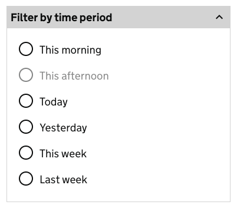

### Filter by date

Filter by date was introduced as user behaviour in the **Alfresco** system means that this feature is required in **Document exchange**.

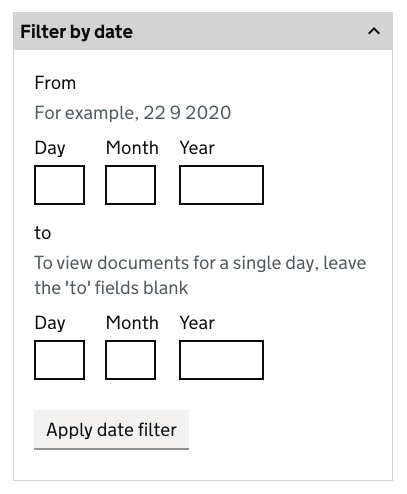

### Filter by provider type and sub-type

Filter by provider type and sub-type were introduced as it was hypothesised that it would aid users in locating documents.

Four versions of this filter were tested, in two broad categories.

**Separate provider type and sub type filters:**

* auto height (all contents visible at once)
* fixed height (with scrollbars)

**Combined provider type and sub type filters:**

* auto height (all contents visible at once)
* fixed height (with scrollbars)

#### Filter by provider type

Filter by provider type, auto height. The list below includes all main provider types.

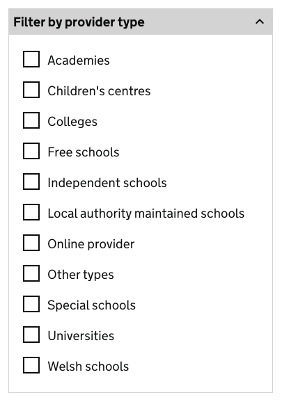

Examples of the versions of this filter can be found here:

* [Provider type, separate, auto height](#download-documents)
* [Provider type, separate, fixed](#download-documents-scroll-list)
* [Provider type and sub-type, combined, auto height](#download-documents-combined-providers)
* [Provider type and sub-type, combined, fixed](#download-documents-combined-scroll-list)

#### Filter by provider sub-type

Filter by provider sub-type, auto height. The list below includes all provider sub-types.

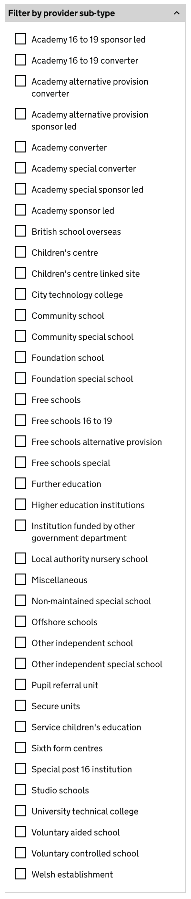

Examples of the versions of this filter can be found here:

* [Provider sub-type, separate, auto height](#download-documents)
* [Provider sub-type, separate, fixed](#download-documents-scroll-list)
* [Provider type and sub-type, combined, auto height](#download-documents-combined-providers)
* [Provider type and sub-type, combined, fixed](#download-documents-combined-scroll-list)

### Documents selected number move

Documents selected indicator number previous version.

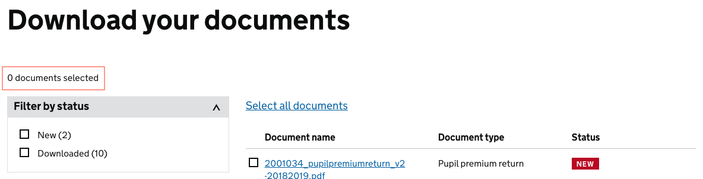

NEW - Documents selected indicator number version 1.

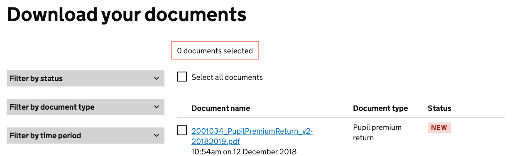

### Select all link to checkbox change

Select all link previous version.

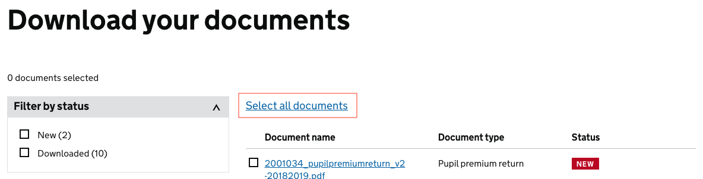

NEW - Select all checkbox version 1.

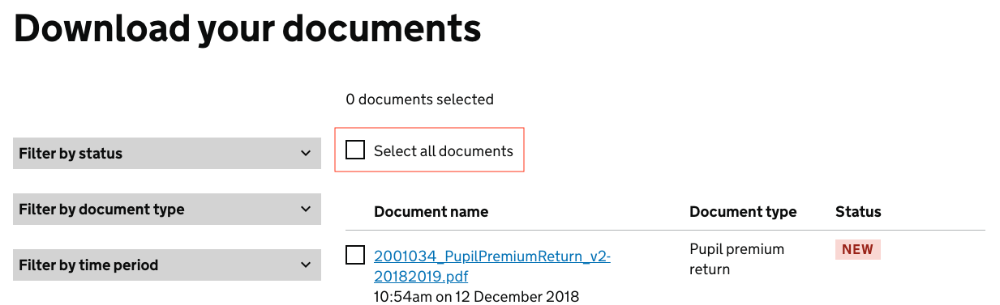

### Table rows update

Table rows previous version.

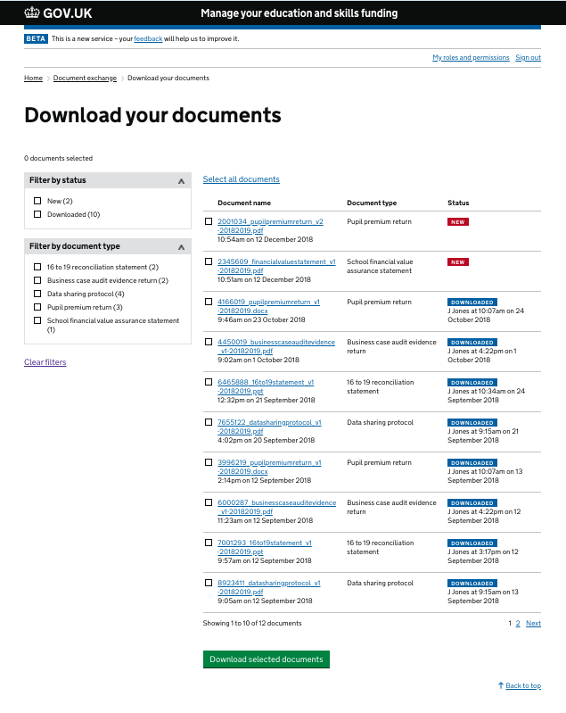

NEW - Table rows version 1.
This version shows the correct number of rows based on the latest pagination. 

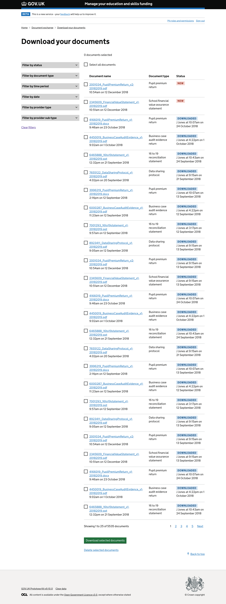

### Delete selected documents

Delete selected documents link introduced to allow advanced users to deleted documents from Document exchange.

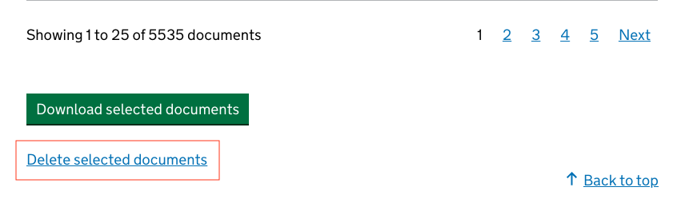

### Number selected indicator

Number selected indicator introduced to test with users to find out if it aided the usability of a long scroll list.

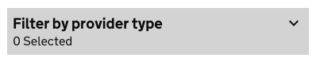

### All screenshots

#### Download documents
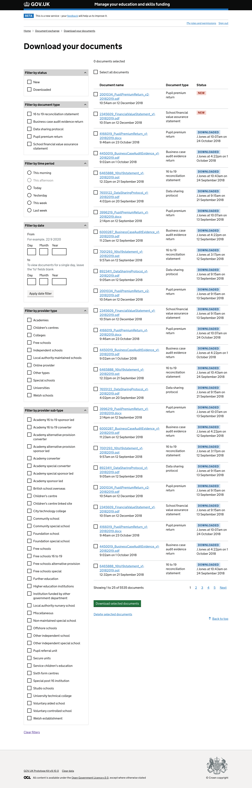

#### Download documents scroll list
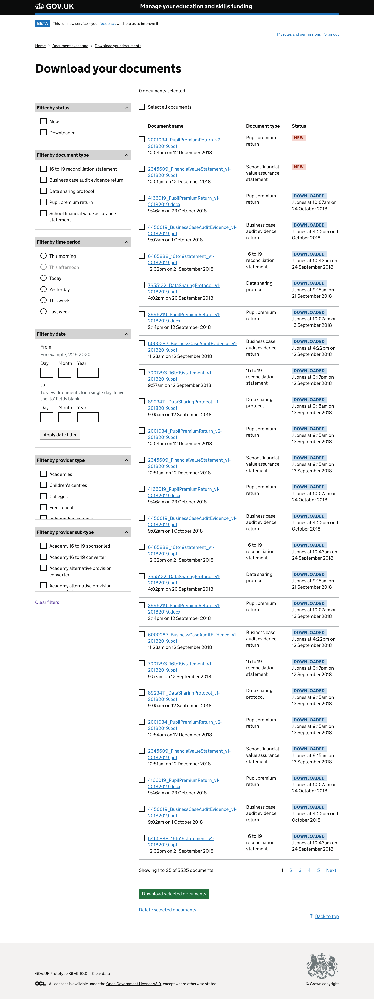

#### Download documents combined providers
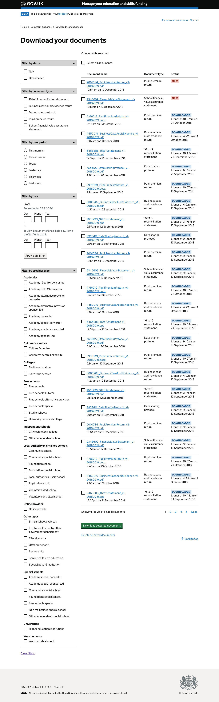

#### Download documents combined scroll list
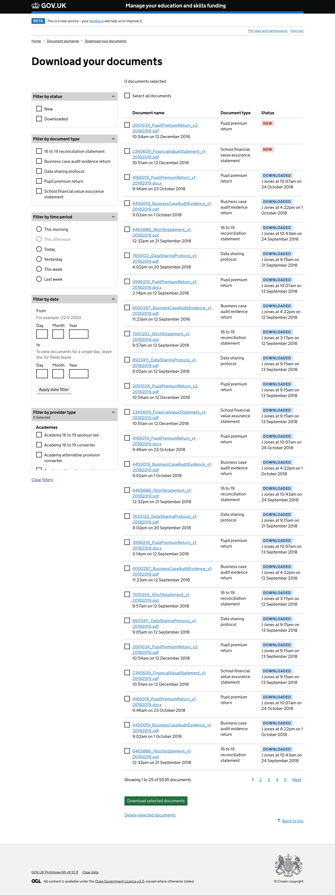

#### Download documents date error state
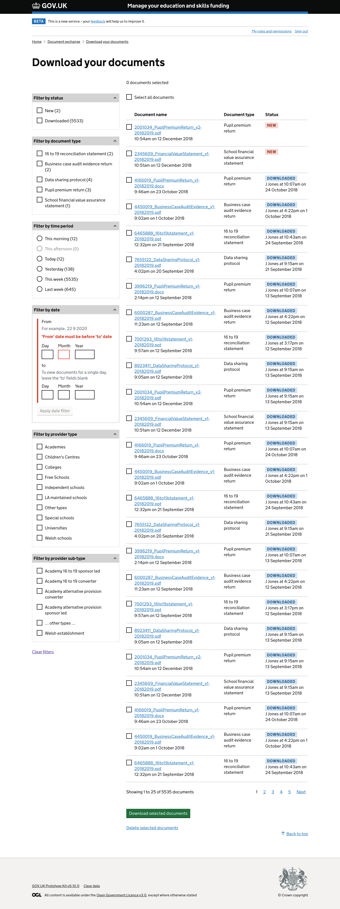
