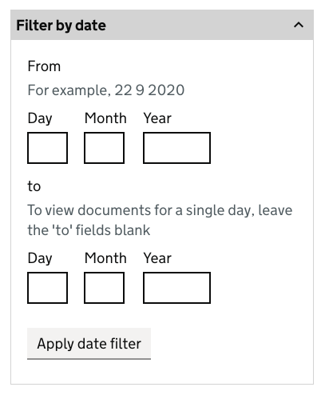

# ESFA MYESF Document Exchange (Doc Ex) internal prototype

This prototype represents the internal view of Document Exchange.

## Version 2

This version is focused on the **'Download your documents'** page.

## Background

This prototype was created using the [GOV.UK prototype kit](https://govuk-prototype-kit.herokuapp.com/docs), version 9.10.0.

It was not created inside the main Skills Funding Agency sfs-sitedesign prototype as:

* the sfs-sitedesign prototype cannot be updated to the latest version of the prototype kit
* adding new pages to the sfs-sitedesign prototype was out of scope
* this prototype was built with speed in mind
* this prototype is to be considered throwaway HTML, CSS and JavaScript - not production code

## Links to the Document exchange internal prototype

### Prototype (Heroku app) ###
[https://myesf-doc-ex-internal.herokuapp.com/](https://myesf-doc-ex-internal.herokuapp.com/)

### GitHub repo ###
[https://github.com/SkillsFundingAgency/myesf-doc-ex-internal](hhttps://github.com/SkillsFundingAgency/myesf-doc-ex-internal)

## Links to the Document exchange internal design history

### Design history (Heroku app) ###
[https://myesf-doc-ex-internal-history.herokuapp.com/](https://myesf-doc-ex-internal-history.herokuapp.com/)

### GitHub repo ###
[https://github.com/SkillsFundingAgency/myesf-doc-ex-internal-design-history](https://github.com/SkillsFundingAgency/myesf-doc-ex-internal-design-history)

## Features prototyped

The features prototyped were:

* [filter by date](#filter-by-date) component iteration
* [filter by date error states](#filter-by-date-error-states) first full version

User interface iterations were also introduced, including:

* incorporating the [combined providers list](#combined-providers-list) filter
* iterating the [document types](#documents-types-filter) filter
* adding a [thousands comma separator](#adding-a-thousands-comma-separator) to the document count

## Screenshots

All screens created/tested in this round:

* [Download your documents](#download-documents-v2)
* [Date error states](#date-error-states)

## Features

### Filter by date

**Previous version** (Version 1) of the 'Filter by date' component.

Changes based on research findings are:

* labels bold and now read '**Date** from' and '**Date** to'
* hint text consistent across 'from' and 'to' fields
* functionality change to require 'from' and 'to' fields to be populated in order to return a single date in line with user behaviour and expectations

**NEW version** (Version 2) of the 'Filter by date' component.

### Filter by date error states

The first version of the full range of ['error states'](#date-error-states) for the 'Filter by date' component was added.

This included error states for:

* when the 'from' date entered is after the 'to' date
* when a day, month or year are not valid numbers
* when one or both dates entered are in the future
* when a day, month or year field is left blank

### Combined providers list

The combined providers list filter was added in response to testing findings.

### Document types filter

The document types filter was updated to reflect the full range of document types that providers can upload.

### Adding a thousands comma separator

A thousands comma separator was added to the document count to align with the [GDS style guide](https://www.gov.uk/guidance/style-guide).

## All screenshots

### Download documents

### Date error states
