# ESFA MYESF Document Exchange (Doc Ex) internal prototype

This prototype represents the internal view of Document Exchange.

## Version 3

This version is focused on the **'Download your documents'** and new **deletion** pages.

### Background

This prototype was created using the [GOV.UK prototype kit](https://govuk-prototype-kit.herokuapp.com/docs), version 9.10.0.

It was not created inside the main Skills Funding Agency sfs-sitedesign prototype as:

* the sfs-sitedesign prototype cannot be updated to the latest version of the prototype kit
* adding new pages to the sfs-sitedesign prototype was out of scope
* this prototype was built with speed in mind
* this prototype is to be considered throwaway HTML, CSS and JavaScript - not production code

## Links to the Document exchange internal prototype

### Prototype (Heroku app) ###
[https://myesf-doc-ex-internal.herokuapp.com/](https://myesf-doc-ex-internal.herokuapp.com/)

### GitHub repo ###
[https://github.com/SkillsFundingAgency/myesf-doc-ex-internal](hhttps://github.com/SkillsFundingAgency/myesf-doc-ex-internal)

## Links to the Document exchange internal design history

### Design history (Heroku app) ###
[https://myesf-doc-ex-internal-history.herokuapp.com/](https://myesf-doc-ex-internal-history.herokuapp.com/)

### GitHub repo ###
[https://github.com/SkillsFundingAgency/myesf-doc-ex-internal-design-history](https://github.com/SkillsFundingAgency/myesf-doc-ex-internal-design-history)

## Features prototyped

The features prototyped were:

* [filter by uploaded today](#filter-by-uploaded-today) (2 variations)
* [filter by provider type](#filter-by-provider-type) iteration
* a deletion '[are you sure](#deletion-are-you-sure-page)' page
* a deletion '[confirmation](#deletion-confirmation-page)' page
* creating an '[Advanced user](#download-documents-advanced-user-view)' view
* adding a '[Filter by team](#filter-by-team)' component to the 'Advanced user' view of the 'Download your documents' page
* an [alternative table format](#alternative-table-format) for the 'Download your documents' page

User interface iterations were also introduced, including:

* removing the [document name link](#removing-the-document-name-link)
* revising the [table row font sizes](#revising-the-table-row-font-sizes)

## Screenshots

All screens created/tested in this round:

* [Download your documents](#download-documents)
* [Download your documents - advanced user view](#download-documents-advanced-user-view)
* [Download your documents - alternative table format](#download-documents-alternative-table-format)
* [Deletion - 'are you sure?' page](#deletion-are-you-sure-page)
* [Deletion - confirmation page](#deletion-confirmation-page)

# Features

## Filter by uploaded today

**Previous version** (Version 1) of the 'Filter by time period' component.

Changes based on research findings are:

* renamed the filter 'Filter by uploaded today' to provide more clarity about its purpose
* reduced the number of options to three - 'Today', 'This morning' and 'This afternoon'
* added hint text to each of the checkboxes to give context to each selection

**NEW version** (Version 2) of the component, renamed 'Filter by uploaded today'.

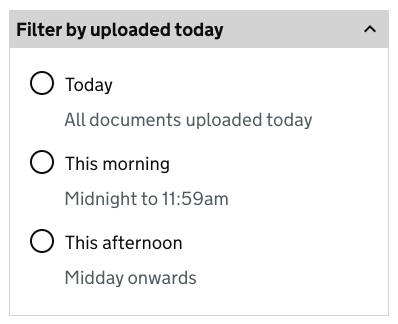

An **alternative version** of this component was designed and tested with research participants. Its functionality and usability did not meet user expectations.

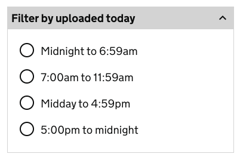

## Filter by provider type

**Previous version** (Version 2) of the 'Filter by provider type' component.

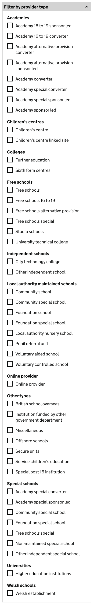

Changes based on research findings are:

* added a checkbox to all top level provider types to allow bulk selection of all sub-types
* indented sub-types to assist hierarchy of information

**NEW version** (Version 3) of the 'Filter by provider type' component.

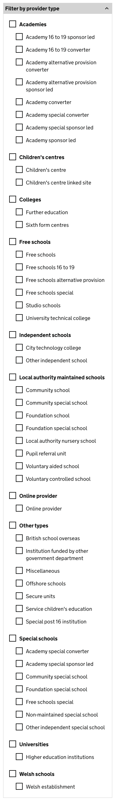

## Filter by team

**NEW version** (Version 1) of the 'Filter by team' component (Advanced users only). This component was added to allow 'Advanced users' to view only 1 team's documents at a time. This was needed to provide a solution to an issue with downloading documents from multiple teams simultaneously.

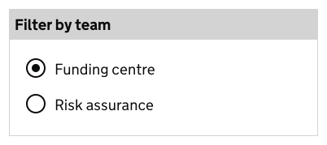

## Alternative table format

**Original** table format.

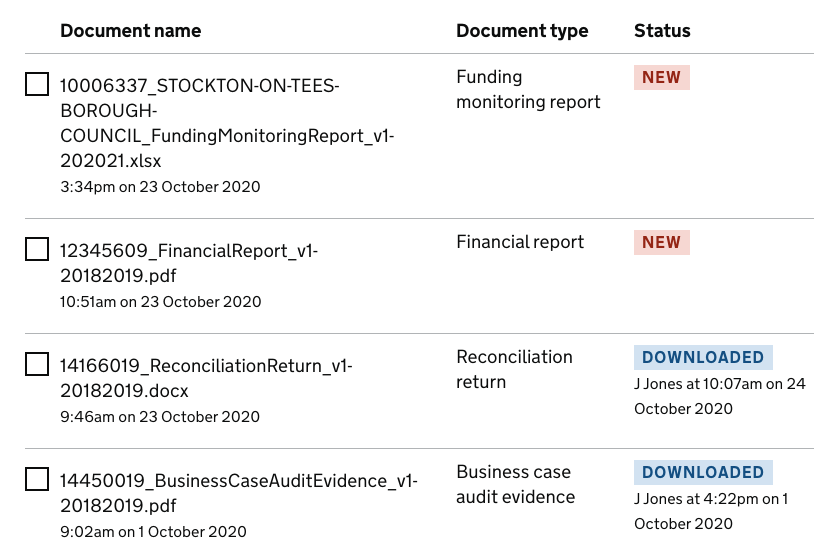

Changes based on research findings are:

* columns changed from 'Document name', 'Document type' and 'Status' to 'Document type', 'Provider name', 'UKPRN' and 'Uploaded'
* document name moved into the 'Document details' section of the row, hidden on page load
* provider name and UKPRN number surfaced independently of document name
* uploaded column shows the date for documents uploaded today in a different format to aid differentiation from those uploaded on previous dates
* 'Downloaded' tag removed from table rows
* download date and 'Downloaded by' and document version data included in the 'Document details' section

**NEW version** (Version 2) of the table format.

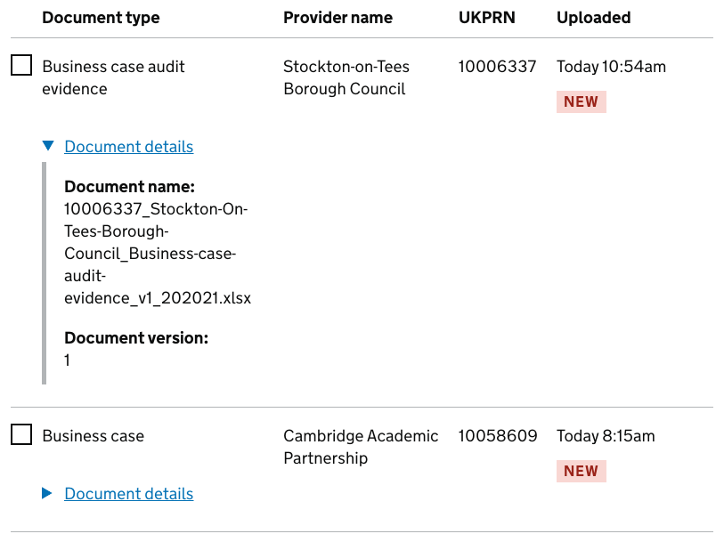

## Removing the document name link

The document name link was removed to help users to avoid downloading documents by mistake with a single click. This was based on testing, where observed user behaviour showed that documents were never intentionally downloaded using the link - users opted for selecting the document using its checkbox and clicking the 'Download selected documents' button instead.

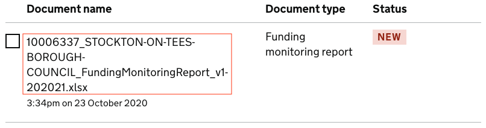

## Revising the table row font sizes

The table row font sizes were revised, with secondary information using the **govuk-body-s** class, to aid differentiation from primary information.

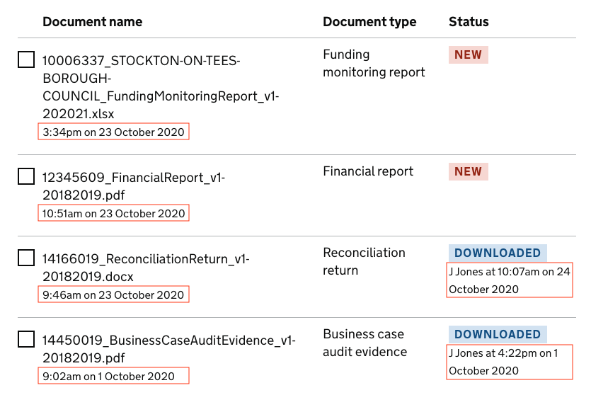

## All screenshots

### Download documents
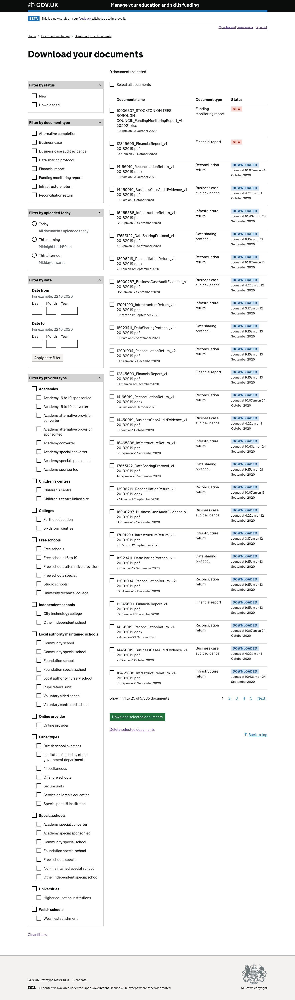

### Download documents advanced user view

### Download documents alternative table format
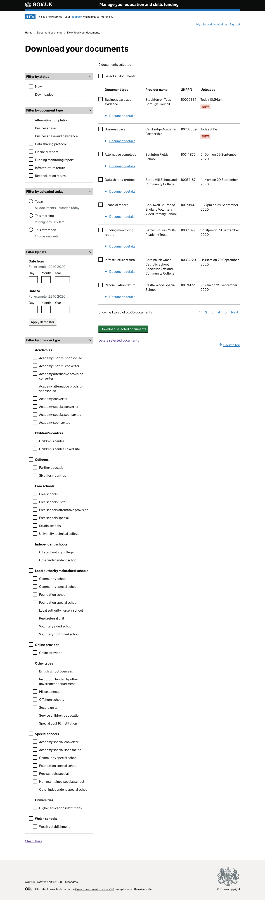

### Deletion are you sure page
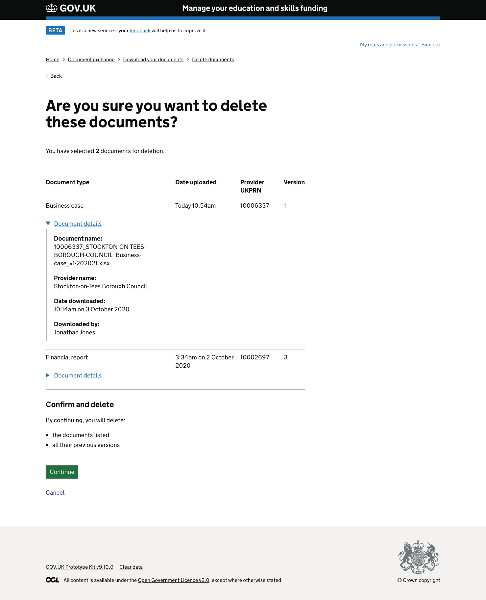

### Deletion confirmation page
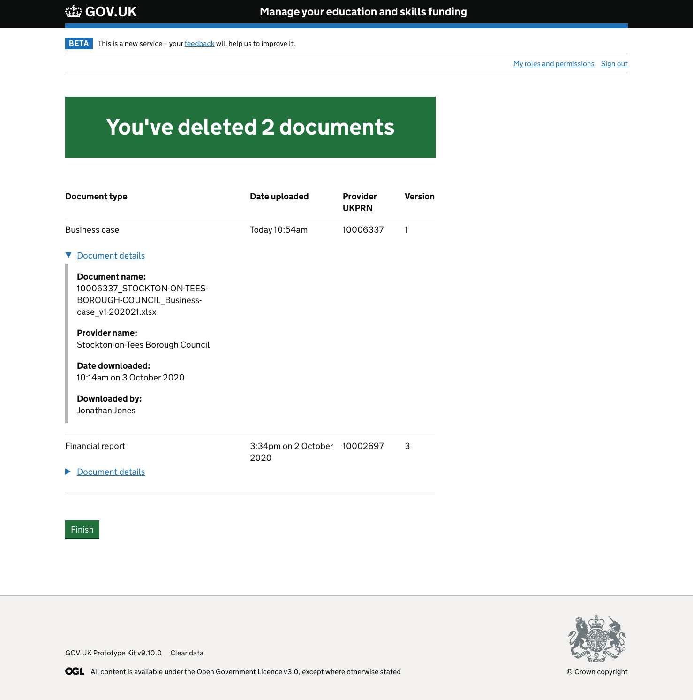