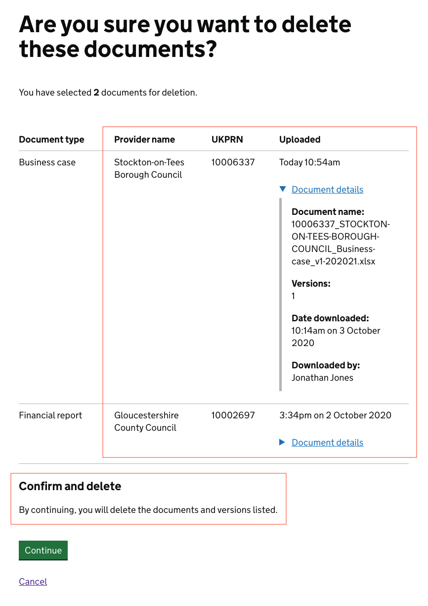

# ESFA Document Exchange (Doc Ex) internal prototype

This prototype represents the internal view of Document Exchange.

# Version 4

This version is focused on the **'Download your documents'** and new **deletion** pages.

## Background

This prototype was created using the [GOV.UK prototype kit](https://govuk-prototype-kit.herokuapp.com/docs), version 9.10.0.

It was not created inside the main Skills Funding Agency sfs-sitedesign prototype as:

* the sfs-sitedesign prototype cannot be updated to the latest version of the prototype kit
* adding new pages to the sfs-sitedesign prototype was out of scope
* this prototype was built with speed in mind
* this prototype is to be considered throwaway HTML, CSS and JavaScript - not production code

## Link to the prototype

Link - to be added when DfE repo and app is created for the prototype

## Features prototyped

The features prototyped were:

* [filter by uploaded today](#filter-by-uploaded-today) iteration
* deletion '[are you sure](#deletion-are-you-sure-page-iteration)' page iteration
* deletion '[confirmation](#deletion-confirmation-page-iteration)' page iteration

## Screenshots

All screens created/tested in this round:

* [Download your documents](#download-documents)
* [Download your documents - advanced user view](#download-documents-advanced-user-view)
* [Deletion - 'are you sure?' page](#deletion-are-you-sure-page)
* [Deletion - confirmation page](#deletion-confirmation-page)

# Features

## Filter by uploaded today

**Previous version** (Version 2) of the component, renamed 'Filter by uploaded today'.

Changes based on research findings are:

* reorderd the options to place the catch-all 'Today' at the bottom of the list. The order is now 'This morning', 'This afternoon' and 'Today'
* made the hint text for 'This morning' and 'This afternoon' more consistent by specifying a timeframe for both

**NEW version** (Version 3) of the component, renamed 'Filter by uploaded today'.

## Deletion are you sure page iteration

**Previous version** (Version 1) of the deletion 'are you sure?' page - detail.

Changes based on research findings are:

* 'Version' column removed and version information added to the 'Document details' section
* 'Date uploaded' and 'Provider UKPRN' columns renamed to 'Uploaded' and 'UKPRN' respectively
* columns reordered to prioritise information users need most
* 'Document details' section moved into the 'Uploaded' column to avoid crowding the 'Document type' column
* the 'Confirm and delete' text simplified

**NEW version** (Version 2) of the deletion 'are you sure?' page - detail.

## Deletion confirmation page iteration

**Previous version** (Version 1) of the deletion confirmation page - detail.

Changes based on research findings are:

* text added to the confirmation message panel to inform the user that a confirmation email has been sent to their team email account
* 'Version' column removed and version information added to the 'Document details' section
* 'Date uploaded' and 'Provider UKPRN' columns renamed to 'Uploaded' and 'UKPRN' respectively
* columns reordered to prioritise information users need most
* 'Document details' section moved into the 'Uploaded' column to avoid crowding the 'Document type' column

**NEW version** (Version 2) of the deletion confirmation page - detail.

## All screenshots

### Download documents

### Download documents advanced user view

### Deletion are you sure page

### Deletion confirmation page
