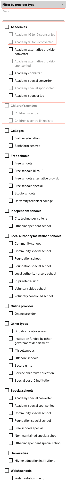

# ESFA Document Exchange (Doc Ex) internal prototype

This prototype represents the internal view of Document Exchange.

# Version 5

This version is focused on the **'Download your documents'** and **'Edit product'** pages.

## Background

This prototype was created using the [GOV.UK prototype kit](https://govuk-prototype-kit.herokuapp.com/docs), version 9.10.0.

It was not created inside the main Skills Funding Agency sfs-sitedesign prototype as:

* the sfs-sitedesign prototype cannot be updated to the latest version of the prototype kit
* adding new pages to the sfs-sitedesign prototype was out of scope
* this prototype was built with speed in mind
* this prototype is to be considered throwaway HTML, CSS and JavaScript - not production code

## Link to the prototype

Link - to be added when DfE repo and app is created for the prototype

## Features prototyped

The features prototyped were:

* [search by UKPRN](#search-by-ukprn)
* an '[Edit product](#edit-product-page)' page
* 'Edit product' page [error states](#edit-product-page-error-states)'
* an 'Edit product' '[Check your changes](#edit-product-check-your-changes-page)' page
* [filter by date error states MVP](#filter-by-date-error-states-mvp) de-scoped/'MVP' (Minimum viable product) version
* [filter by provider type](#filter-by-provider-type) iteration

## Screenshots

All screens created/tested in this round:

* [Download your documents](#download-documents)
* [Download your documents - advanced user view](#download-documents-advanced-user-view)
* [Edit product page](#edit-product)
* [Edit product Check your changes](#edit-product-check-your-changes)
* [Edit product page error states](#edit-product-error-states)
* [Filter by date error states MVP](#date-error-states-mvp)

# Features

## Search by UKPRN

A 'Search by UKPRN' component was added to the 'Download your documents' page.

This component supports user behaviours:

* when searching for a document from a specific provider in order to confirm its receipt
* when searching for a document from a specific provider in order to delete it due to a GDPR issue

## Edit product page

**NEW version** (Version 2) of the 'Edit product' page. Version 1 was built without UX design input.

Suggested changes are:

* make form field lengths correspond to the data to be input
* revisit field labels and hint text to clarify the field purpose and help prevent errors
* provide a character count indicator to aid valid file name creation

## Edit product page error states

**NEW version** (Version 1) of the 'Edit product' page error states.

Error messages/states created for:

* duplicate identifier - 'Number aleady in use'
* identifier too short/long - 'Identifier must be a 5 digit number'
* identifier field blank - 'Enter a 5 digit number'
* 'Document name' and 'Document plural name' fields blank - 'Enter a document name' and 'Enter a document plural name' respectively

## Edit product check your changes page

**NEW version** (Version 1) of Edit product 'Check your changes' page.

The product information is displayed in a GOV.UK design system [summary list](https://design-system.service.gov.uk/components/summary-list/) format. Each entry can be amended by using the associated 'Change' link.

## Filter by date error states MVP

This iteration of 'Filter by date' ['error states'](#date-error-states-mvp) was created as a de-scoped/'MVP' (Minimum viable product) version.

It includes a reduced number of error messages to cover:

* when the 'from' date entered is after the 'to' date - covered by **'From' date must be the same as or before 'to' date**
* when a day, month or year are not valid numbers - now covered by **'Invalid date - please review'**
* when one or both dates entered are in the future - now covered by **'Invalid date - please review'**
* when a day, month or year field is left blank - now covered by **'Invalid date - please review'**

## Filter by provider type

This component was iterated based on research findings that:

* users expected a search function to aid their navigation of the list of providers
* users responded well to the 'full'/'long' list of providers

It is hypothesised that users will 'learn' the structure of this list, and will be able to navigate it more easily if its structure does not change dynamically when documents are not present for provider types and sub-types.

**Previous version** (Version 3) of the 'Filter by provider type' component.

This iteration of 'Filter by provider type' includes:

* a search input to search the list of provider types
* disabled sub-type checkboxes where no documents exist for this sub-type
* disabled provider type checkboxes where no documents exist for a top-level provider type

**NEW version** (Version 4) of the 'Filter by provider type' component.

## All screenshots

### Download documents

### Download documents advanced user view

### Edit product

### Edit product error states

### Edit product Check your changes

### Date error states MVP
