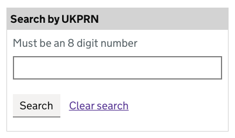
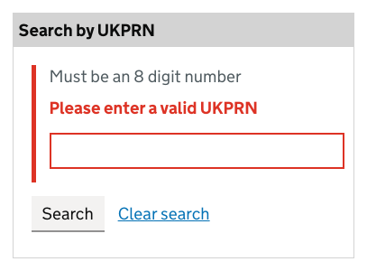
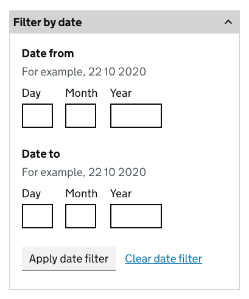
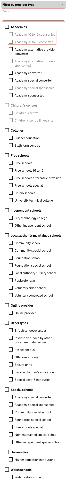
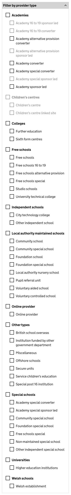
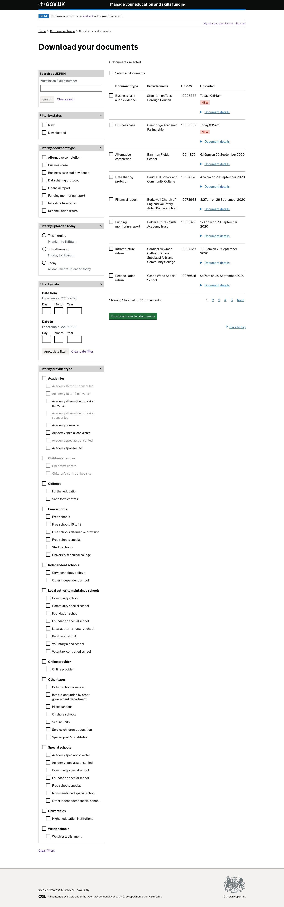
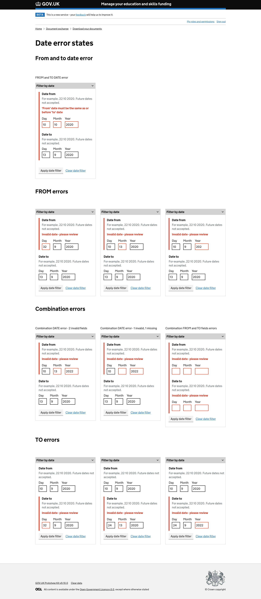

# ESFA MYESF Document Exchange (Doc Ex) internal prototype

This prototype represents the internal view of Document Exchange.

## Version 6

This version is focused on the **'Download your documents'** page.

## Background

This prototype was created using the [GOV.UK prototype kit](https://govuk-prototype-kit.herokuapp.com/docs), version 9.10.0.

It was not created inside the main Skills Funding Agency sfs-sitedesign prototype as:

* the sfs-sitedesign prototype cannot be updated to the latest version of the prototype kit
* adding new pages to the sfs-sitedesign prototype was out of scope
* this prototype was built with speed in mind
* this prototype is to be considered throwaway HTML, CSS and JavaScript - not production code

## Links to the Document exchange internal prototype

### Prototype (Heroku app) ###
[https://myesf-doc-ex-internal.herokuapp.com/](https://myesf-doc-ex-internal.herokuapp.com/)

### GitHub repo ###
[https://github.com/SkillsFundingAgency/myesf-doc-ex-internal](hhttps://github.com/SkillsFundingAgency/myesf-doc-ex-internal)

## Links to the Document exchange internal design history

### Design history (Heroku app) ###
[https://myesf-doc-ex-internal-history.herokuapp.com/](https://myesf-doc-ex-internal-history.herokuapp.com/)

### GitHub repo ###
[https://github.com/SkillsFundingAgency/myesf-doc-ex-internal-design-history](https://github.com/SkillsFundingAgency/myesf-doc-ex-internal-design-history)

## Features prototyped

The features prototyped were:

* [search by UKPRN update](#search-by-ukprn-update)
* [filter by date update](#filter-by-date-update)
* [filter by date error states MVP update](#filter-by-date-error-states-mvp-update) new version of the de-scoped/'MVP' (Minimum viable product) version
* [filter by provider type](#filter-by-provider-type-iteration) iteration

## Screenshots

All screens created/tested in this round:

* [Download your documents](#download-documents)

## Features

### Search by UKPRN update

The 'Search by UKPRN' component on the 'Download your documents' page was updated.

The update to this component
* allows users to clear the UKPRN search and return to the default view of the page.
* provides hint text for the UKPRN input

**Error state** for UKPRN search

### Filter by date update

The 'Filter by date' component on the 'Download your documents' page was updated.

The update to this component allows users to clear the date search.

### Filter by date error states MVP update

The 'Filter by date' ['error states'](#date-error-states-mvp-update) de-scoped/'MVP' (Minimum viable product) version was updated to include the 'Clear date filter' link.

### Filter by provider type iteration

This component was iterated based on the hypothesis that:

* users would learn the 'shape' of the providers list
* users would benefit from the providers list maintaining a consistent 'shape'
* users would perceive disabled checkboxes to mean that no documents matched the input/selection

**Previous version** (Version 4) of the 'Filter by provider type' component.

This iteration of 'Filter by provider type':

* removes the search input to search the list of provider types
* includes disabled sub-type checkboxes where no documents exist for this sub-type
* includes disabled provider type checkboxes where no documents exist for a top-level provider type

**NEW version** (Version 5) of the 'Filter by provider type' component.

## All screenshots

### Download documents

### Date error states MVP update
