# ESFA MYESF Document Exchange (Doc Ex) internal prototype

This prototype represents the internal view of Document Exchange.

## Version 7

This version is focused on the **'Download your documents'** and **'Publish your documents'** pages.

## Background

This prototype was created using the [GOV.UK prototype kit](https://govuk-prototype-kit.herokuapp.com/docs), version 9.10.0.

It was not created inside the main Skills Funding Agency sfs-sitedesign prototype as:

* the sfs-sitedesign prototype cannot be updated to the latest version of the prototype kit
* adding new pages to the sfs-sitedesign prototype was out of scope
* this prototype was built with speed in mind
* this prototype is to be considered throwaway HTML, CSS and JavaScript - not production code

## Links to the Document exchange internal prototype

[//]: # (This comment should not appear in the HTML output)
<!--- This comment should appear in the HTML output - but doesn't! -->

<!--- DONE -->
### Prototype (Heroku app) ###
[https://myesf-doc-ex-internal.herokuapp.com/](https://myesf-doc-ex-internal.herokuapp.com/)

<!--- DONE -->
### GitHub repo ###
[https://github.com/SkillsFundingAgency/myesf-doc-ex-internal](https://github.com/SkillsFundingAgency/myesf-doc-ex-internal)

## Links to the Document exchange internal design history

<!--- DONE -->
### Design history (Heroku app) ###
[https://myesf-doc-ex-internal-history.herokuapp.com/](https://myesf-doc-ex-internal-history.herokuapp.com/)

<!--- DONE -->
### GitHub repo ###
[https://github.com/SkillsFundingAgency/myesf-doc-ex-internal-design-history](https://github.com/SkillsFundingAgency/myesf-doc-ex-internal-design-history)

## Context of this version of the prototype
### Technical constraints
A technical issue was discovered when larger numbers of documents (c. 300+) were selected and the user chose to:
* 'Download selected documents'
* 'Publish selected documents'

This was due a unique request being created for every document checkbox checked/selected, leading to hundreds of requests crashing the system.

### Technical solution
To mitigate this issue, 'Select all' functionality will be removed from the publish and download pages, as 'Select all' works by applying a 'checked' status to the checkbox of each available document.

### Design solution
In response to the removal of 'Select all' functionality, a design update was required to continue to enable selection and download of smaller numbers of documents whilst providing a way for larger numbers of documents to be downloaded and published.

## Features prototyped

The features prototyped were:

* [Document exchange service start page](#service-start-page)
* [DfE Sign-in mockup](#sign-in)
* [Document exchange home](#home)
* [Download your documents changes](#download-your-documents)
* ['Delete selected documents' button (styled as a link) - advanced users only](#delete-selected-documents---advanced-users-only)
* [File share page](#file-share-documents)
* [Publish your documents changes](#publish)
* [Publish documents - confirm](#publish-confirm) <!--- -->
* [Publish documents - confirmation](#publish-confirmation) <!--- -->
* [External documents received from ESFA](#external-document-download) <!--- -->

## Screenshots

All screens created/tested in this round:
<!--- List complete 11-1-2021 -->
* [Document exchange service start page](#document-exchange-service-start-page)
* [DfE Sign-in](#dfe-sign-in)
* [Document exchange home](#document-exchange-home)
* [Download your documents](#download-documents)
* [Download your documents - advanced user view](#download-documents-advanced-user-view)
* [File share](#file-share)
* [Publish documents - 14 to 16 revenue funding allocation statements selected](#publish-documents---14-to-16-revenue-funding-allocation-statements-selected)
* [Publish documents - business case audit evidence requests selected - showing pagination](#publish-documents---business-case-audit-evidence-requests-selected---showing-pagination)
* [Publish documents - confirm - 14 to 16 revenue funding allocation statements](#publish-documents---confirm---14-to-16-revenue-funding-allocation-statements)
* [Publish documents - publishing confirmation - 14 to 16 revenue funding allocation statements](#publish-documents---publishing-confirmation---14-to-16-revenue-funding-allocation-statements)
* [EXTERNAL - Documents received from ESFA](#external---documents-received-from-esfa)

<!--- FEATURES -->
## Features

### Service start page

First prototype for a standalone Document exchange service start page, ready for DfE Sign-in onboarding.

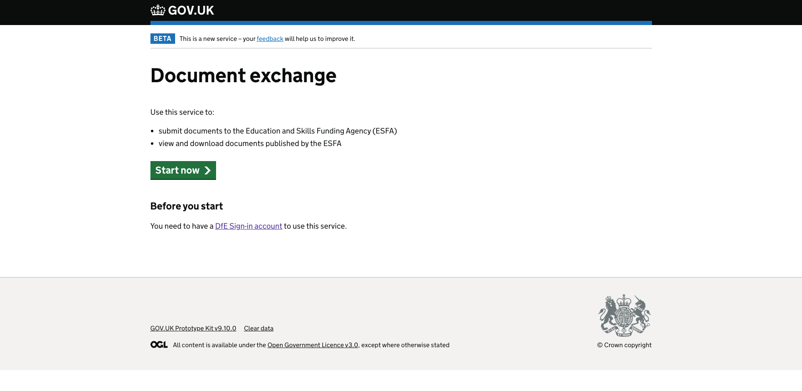

---

### Sign in

Mockup of DfE Sign-in (DSI) page, to demonstrate screen flows in the new user journey.

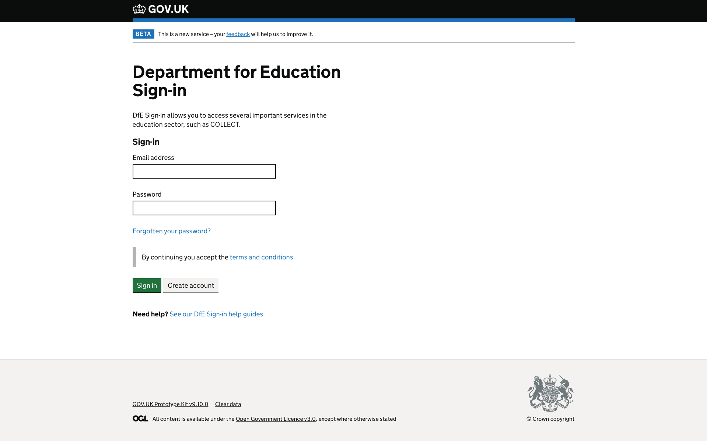

---

### Home

Document exchange home page (internal view), displaying 2 'tiles', 'Publish documents from your file share' and 'Download documents'.

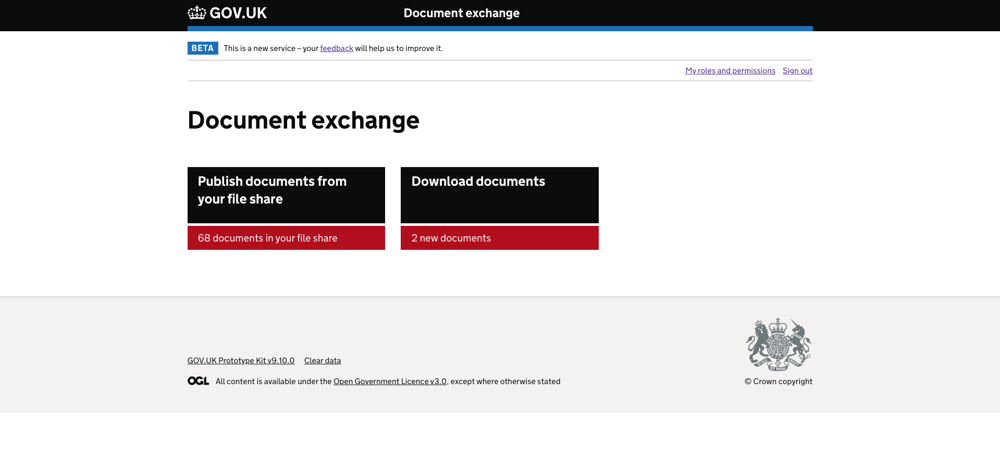

---

### Download your documents

Changes are:

* removing 'Select all' funcionality
* a new primary button - 'Download all filtered documents' (was 'Download selected documents')
* a new secondary button - 'Download selected documents'

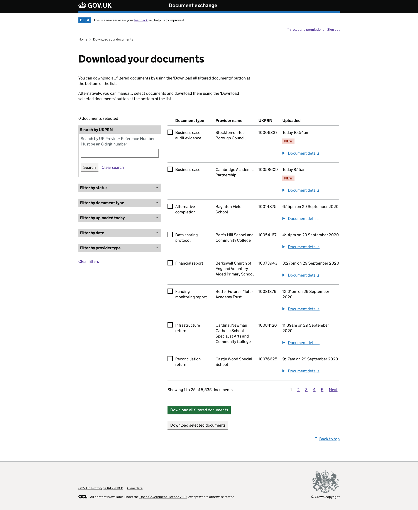

---

### Delete selected documents - advanced users only

To preserve deletion functionality a button, styled as a link, has been added to the advanced user view.

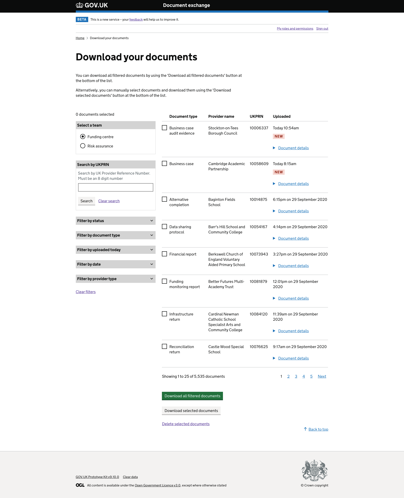

---

### File share documents

A file page has been created, to demonstrate screen flows in the new user journey.

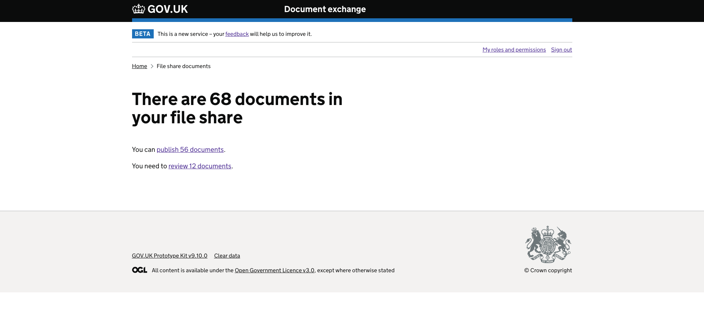

---

### Publish

Changes are:

* removing 'Select all' funcionality
* removing document selection checkboxes from the table
* removing the hyperlink from document names in the table
* changing 'Filter by document type' to 'Select a document type'
* changing document type selection from checkboxes to radio buttons to allow only one document type to be selected at a time
* a new paragraph showing the count of documents that can be published for the selected document type
* the primary button is now 'Publish all' (formerly 'Publish selected documents)

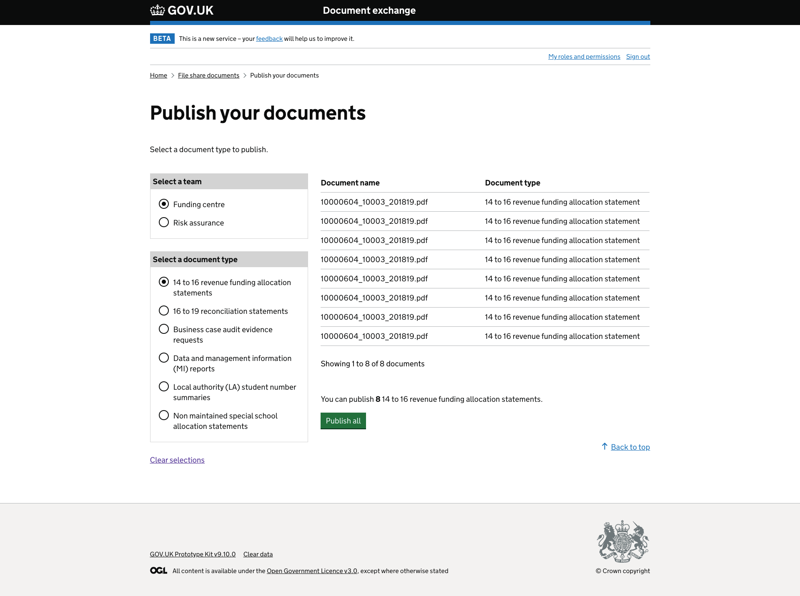
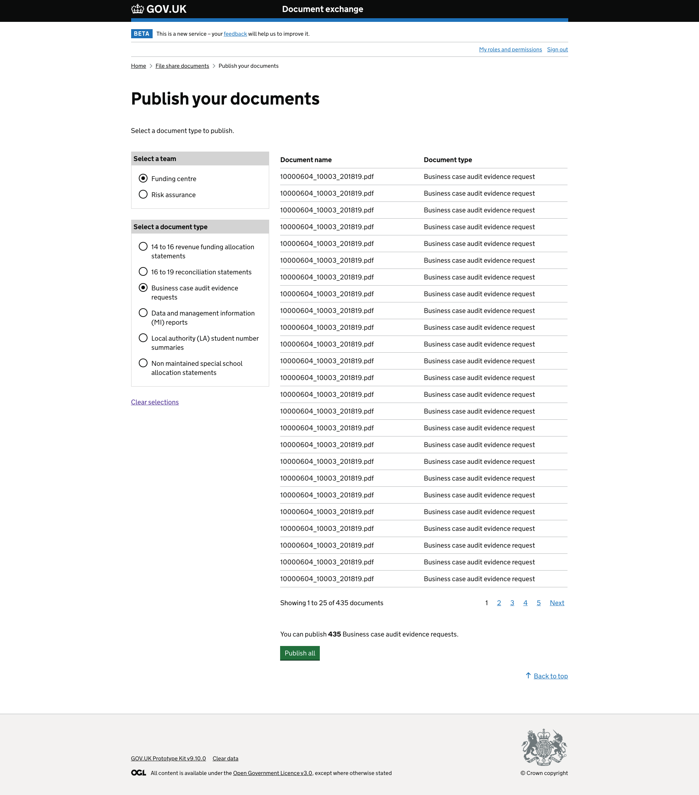

---

### Publish confirm

An 'Are you sure' confirm page has been created.

Changes are:
* the document count has been removed from the page heading
* hint text has been added, showing the document count

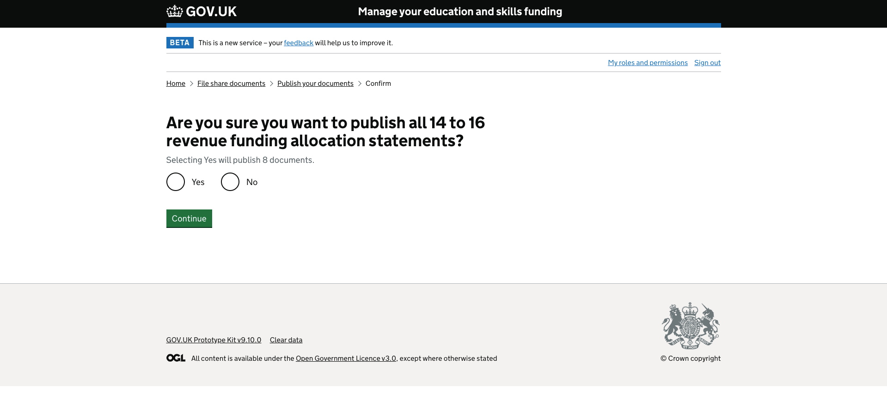

---

### Publish confirmation

A confirmation page has been created, to demonstrate screen flows in the new user journey.

The banner style differs from production, as the service needs to be updated to use GOV.UK Frontend.

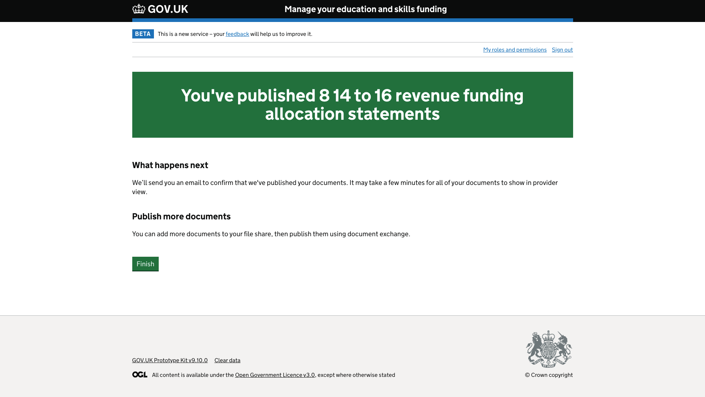

---

### EXTERNAL document download

To mitigate the 'Select all' issue, it has been neccessary to update the 'Documents received from ESFA' screen for Multi Academy Trusts (MATs).

Changes are:

* removing 'Select all' funcionality
* removing the hyperlink from document names in the table

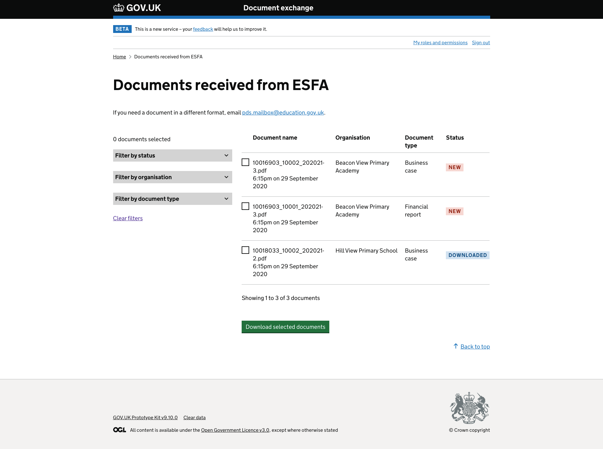

---

<!--- SCREENSHOTS -->
## All screenshots

### Document exchange service start page

### DfE Sign-in

### Document exchange home

### Download documents

### Download documents advanced user view

### File share

### Publish documents - 14 to 16 revenue funding allocation statements selected

### Publish documents - business case audit evidence requests selected - showing pagination

### Publish documents - confirm - 14 to 16 revenue funding allocation statements

### Publish documents - publishing confirmation - 14 to 16 revenue funding allocation statements

### EXTERNAL - Documents received from ESFA
